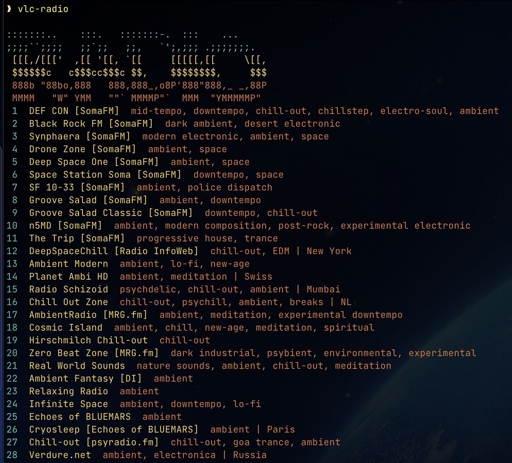
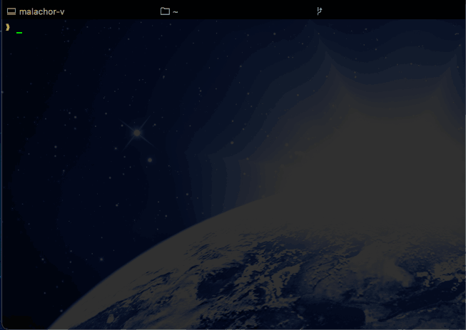
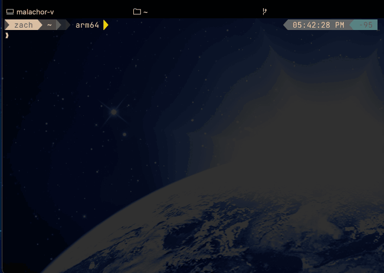
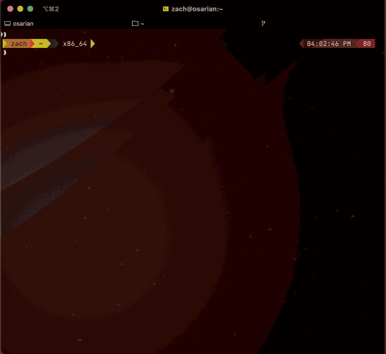
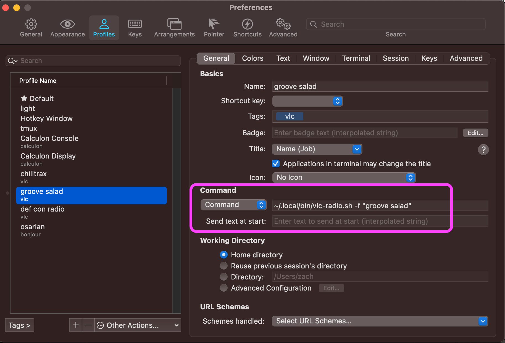

[](https://results.pre-commit.ci/latest/github/zcutlip/chill_streams/main)

# Chill Electronica Streams

## Description

This project is a directory of chill electronica streaming radio stations. If you like [DEF CON radio](https://somafm.com/defcon/) or [Groove Salad](https://somafm.com/groovesalad/) on Soma.fm, this is for you.

This project provides three things:

1. A directory of streaming radio station URLs
2. A Python API for accessing that directory
3. A command-line utility to present a menu and launch VLC with a selected URL

## Installation

### Requirements

- OS:
  - Probably most modern (reasonable) Linux distros, but late Ubuntu releases are known to work
  - Late macOS versions (tested on macOS 11.4 with up-to-date homebrew installed)
  - Windows probably won't work (but might be easily made to, let me know)
- Python >= 3.8 (3.9 preferred)
- VLC, with the `vlc` command line utility on your `$PATH` (the homebrew VLC cask on macOS sets this up for you)
  - Alternatively you may set `VLC_PATH` to point to a `vlc` executable:
  - e.g. `export VLC_PATH=~/Applications/VLC.app/Contents/MacOS/VLC`
- In order to stream Twitch video channels, the `streamlink` package is required (see installation below)

> Note: VLC on Apple Silicon macOS doesn't support ncurses mode for some reason. I'm pretty sure it's a bug, but I haven't filed one yet. Run with `--gui`, or install the x86 version

> Note: Twitch streams from DEF CON music are possible if `streamlink` is installed, but this is not a hard requirement. If it is not installed video channels will not be presented in the menu or available for playback.

### Installation, but for real this time

You can install directly from PyPI:

```bash
pip install --user Chill-Streams
# Optional support for Twitch streams
pip install --user streamlink
```

## CLI utility: `vlc-radio`

The `vlc-radio` utility starts up VLC Media Player playing one of the stations in the directory.

It has a few modes of operation:

- VLC running in text (ncurses) mode or GUI mode
- An interactive menu of stations to select from
- Direct play by station number
- Direct play by station name
- If a partial station name is provided and the match is ambiguous, a reduced menu is presented
- First match: if the match is ambiguous, directly play the first option

### CLI Options

```console
usage: vlc-radio [-h] [-f] [--gui] [--write-shell-script] [--version]
                 [station]

Chill Streams: Chill electronica streaming [version 0.1.1.dev0]

positional arguments:
  station               Index or (partial) name of station to play

optional arguments:
  -h, --help            show this help message and exit
  -f, --first-match     Choose first partial station name match
  --gui                 Disable ncurses interface, run VLC in GUI mode
  --write-shell-script  Write a shell script that sets up environment and
                        executes vlc-radio
  --version             Print version string and exit
```

If you just run 'vlc-radio', you get a selection menu of what station to play:


But, if you already know what station you want, you can ask for it directly:


If you know the name or partial name of a station, you can ask for it. If the match isn't ambiguous, `vlc` will play the station directly. If it *i*s ambiguous, you'll get a reduced selection list:



Note that case and whitespace is ignored when asking for a station, so "DEF CON" and "defcon" are equivalent.

If you just want the first match (e.g., "groove salad" not "groove salad classic"), use the `-f` or `--first-match` option:



Some stations are live video streams, such as the Twitch streams for [DEF CON Music](https://www.twitch.tv/defcon_music) and [DEF CON Chillout Lounge](https://www.twitch.tv/defcon_chill). In order to stream these, be sure `streamlink` is installed via `pip` (see installation section above). When you choose one of these from the menu, VLC automaticaly runs in GUI mode.



### Bootstrap Script

You can use the `--write-shell-script` option to write a shell script that will boostrap `vlc-radio` for use in minimal environments. This is useful, for example, to create a dedicated terminal profile that just runs `vlc-radio` with specific station. Since no shell gets initialized, `$PATH` may not be set, and the location of VLC may not be known.

Below is such a profile in iTerm2:



## Credit

Thanks to [nick3499](https://github.com/nick3499) for the [original project](https://github.com/nick3499/radio_streams_vlc) this is forked from, and for curating a comprehensive directory of shoutcast stations.
